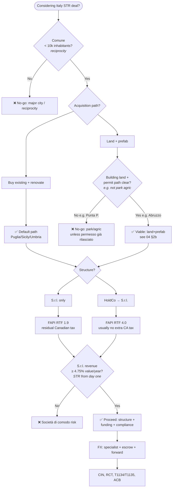
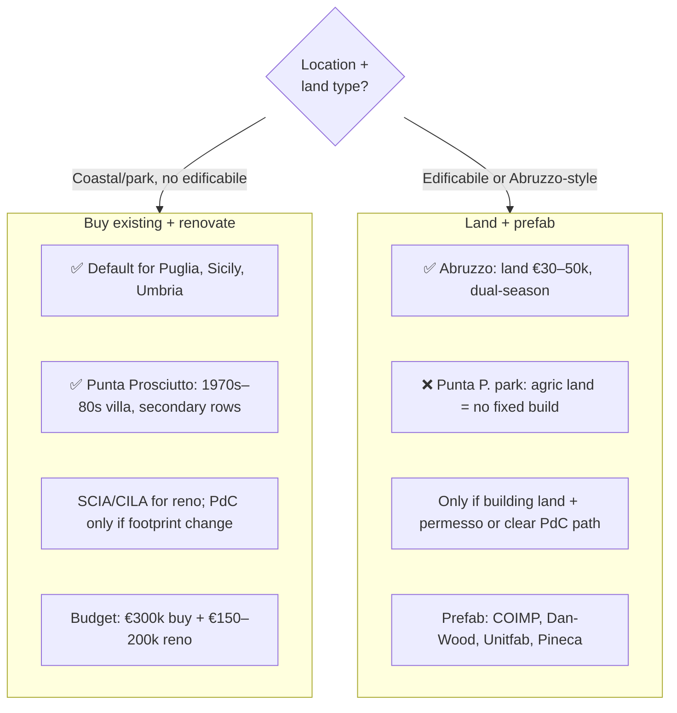

# Decision Interface — Italy Deal #1

Single place to see **how decisions flow**, **where you are** in the process, and **where to look** for detail. Use the diagrams to sanity-check the path; use the tables to jump to the right doc.

---

## 1. Go / no-go decision flow

High-level gates. If any "No" is true for your situation, treat as no-go or change the plan.

**Takeaway:** Confirm **comune**, choose **path** (reno default; prefab only with buildable land), pick **structure**, plan **≥4.75%** revenue, then fund and comply.

---

## 2. Stage-gate pipeline

Where you are and what unlocks the next phase. Each gate has criteria; links point to the doc that has the detail.

```mermaid
flowchart LR
    subgraph Discover["1. Discover"]
        D1[Regions shortlist]
        D2[Punta P. / Salento]
    end
    
    subgraph Target["2. Target"]
        T1[Comune & reciprocity]
        T2[Asset: reno vs prefab]
    end
    
    subgraph Structure["3. Structure"]
        S1[S.r.l. setup]
        S2[Canada: HoldCo?]
    end
    
    subgraph Acquire["4. Acquire"]
        A1[CF, geometra, proposta]
        A2[Compromesso → Rogito]
    end
    
    subgraph Build["5. Build"]
        B1[Permits: CILA/SCIA/PdC]
        B2[CAR + RC Postuma]
    end
    
    subgraph Operate["6. Operate"]
        O1[CIN, RCT, STR policy]
        O2[SPOT, cedolare, tax]
    end
    
    subgraph Decide["7. Decide"]
        Dec[Keep / Sell / Refi<br/>12–18–24 mo]
    end
    
    Discover --> Gate1{Comune<br/><10k?}
    Gate1 --> Target
    Target --> Gate2{Path +<br/>structure set?}
    Gate2 --> Structure
    Structure --> Gate3{Funding +<br/>notary ready?}
    Gate3 --> Acquire
    Acquire --> Gate4{Permits +<br/>insurance?}
    Gate4 --> Build
    Build --> Gate5{CIN +<br/>revenue plan?}
    Gate5 --> Operate
    Operate --> Decide
```

| Stage | Gate | If you need detail → |
|-------|------|----------------------|
| **1. Discover** | — | [04-operations §1](04-operations.md#1-deal-flow--asset-selection) (regions), [09 result](research/results/09-Salento%20STR%20Market%20Research%20Report.md) (Punta P.) |
| **2. Target** | Comune &lt;10k, path chosen | [05 §3](05-finance-compliance-risks.md#3-compliance-and-tax-checklist) (reciprocity), [00-Research-TLDR](00-Research-TLDR.md) (no-gos) |
| **3. Structure** | S.r.l. (+ HoldCo?), revenue ≥4.75% | [05 §3](05-finance-compliance-risks.md#3-compliance-and-tax-checklist) (S.r.l., Canada tax), [03 result](research/results/03-Italian%20S.r.l.%20for%20Canadian%20Property%20Owners.md) |
| **4. Acquire** | FX + notary escrow, geometra | [05 §1](05-finance-compliance-risks.md#1-funding) (FX), [05 §3](05-finance-compliance-risks.md#3-compliance-and-tax-checklist) (purchase process), [07 result](research/results/07-Italian%20Property%20Purchase%20for%20Investors.md) |
| **5. Build** | Permits, CAR, RC Postuma | [04 §2](04-operations.md#2-renovation--construction), [04 §2b](04-operations.md#2b-alternative-prefab--new-construction-on-land), [08 result](research/results/08-Italian%20Property%20Insurance%20for%20Investors.md) |
| **6. Operate** | CIN, RCT, STR policy, reporting | [04 §3](04-operations.md#3-exploitation-if-rental--mode-c), [05 result](research/results/05-Italy%20Short-Term%20Rental%20Regulations%20Research.md) |
| **7. Decide** | Keep / Sell / Refi | [04 §4](04-operations.md#4-decision-gate-1218-or-24-months) |

---

## 3. Path comparison (Reno vs Prefab)

When each path is viable and what to watch.

| If you want… | Path | Check |
|--------------|------|--------|
| **Puglia / Salento / Punta Prosciutto** | **Reno** | [04 §1 Punta P. summary](04-operations.md#research-summary-punta-prosciutto--salento--market-str-permits-feb-2026), [09 result](research/results/09-Salento%20STR%20Market%20Research%20Report.md) |
| **Land + new build** | **Prefab** only where buildable | [04 §2b](04-operations.md#2b-alternative-prefab--new-construction-on-land), [01 result](research/results/01-Prefab%20Home%20Manufacturers%20For%20Italy.md); avoid park agric |
| **Val di Noto / Umbria** | **Reno** | [04 §1 regions](04-operations.md#research-summary-best-italian-regions-for-str--value-add-under-500k-feb-2026), [06 result](research/results/06-Italian%20Real%20Estate%20Investment%20Shortlist.md) |

---

## 4. "I need to decide…" → Where to look

| Decision | Where to look |
|----------|----------------|
| **Is this comune allowed?** | [05 §3 Reciprocity](05-finance-compliance-risks.md) — comuni &lt;10k; confirm with notary before caparra. |
| **Reno or prefab here?** | [00-Research-TLDR No-gos](00-Research-TLDR.md#no-gos-and-red-lines), [04 §1 Punta P.](04-operations.md#research-summary-punta-prosciutto--salento--market-str-permits-feb-2026). |
| **S.r.l. only vs HoldCo?** | [05 §3 Canada tax](05-finance-compliance-risks.md#research-summary-canadian-tax-on-italian-real-estate-srl-held-by-canadians-feb-2026) — FAPI RTF 1.9 vs 4.0, T1134. |
| **How much cash to have ready?** | [05 §2](05-finance-compliance-risks.md#2-banks--lenders--questions-to-prepare) — €300–350k liquid for €500k deal; [05 §1 FX](05-finance-compliance-risks.md#research-summary-fx-cadeur--transfer-conversion-hedging-feb-2026). |
| **How to send EUR?** | [05 §1 FX](05-finance-compliance-risks.md#research-summary-fx-cadeur--transfer-conversion-hedging-feb-2026) — Wise (deposit), MTFX/OFX (main + closing), notary escrow, forward if &gt;60 days. |
| **What permits for this reno?** | [04 §1 permit hierarchy](04-operations.md#research-summary-best-italian-regions-for-str--value-add-under-500k-feb-2026), [04 §1 Punta P.](04-operations.md#research-summary-punta-prosciutto--salento--market-str-permits-feb-2026) — CILA/SCIA; PdC if new build. |
| **What insurance do we need?** | [04 §2b Insurance](04-operations.md#research-summary-insurance--construction-and-str-feb-2026) — CAR + RC Postuma (build), STR policy + RCT (operate). |
| **What STR compliance?** | [04 §3 STR regulation](04-operations.md#research-summary-italy-short-term-rental-regulation-feb-2026) — CIN, safety, RC, SPOT, cedolare. |
| **What to report in Canada?** | [05 §3 Canada](05-finance-compliance-risks.md#research-summary-canadian-tax-on-italian-real-estate-srl-held-by-canadians-feb-2026), [05 §1 FX](05-finance-compliance-risks.md#research-summary-fx-cadeur--transfer-conversion-hedging-feb-2026) — T1134, T1135, ACB, Quebec TP-1079. |

---

## 5. Key numbers at a glance

| What | Number / rule |
|------|----------------|
| **Budget (€500k all-in)** | ~€300–350k liquid (equity + 16–18% costs + valuation gap + S.r.l. setup) |
| **Reciprocity** | Comune &lt;10k inhabitants (confirm with notary) |
| **S.r.l. revenue** | ≥4.75% of property value per year (plan STR from day one) |
| **Closing cost (S.r.l.)** | 15–22%; 9% on actual price (resale) |
| **Timeline to rogito** | 4–6 months (S.r.l.); corporate bank KYC main delay |
| **FX (€400k)** | Specialist ~$3–6k vs Big 5 ~$15–25k; forward if compromesso→rogito &gt;60 days |
| **STR insurance (annual)** | ~€500–1,000 (building + contents + STR + RCT ≥€1.5M) |
| **Canadian reporting** | T1134 (S.r.l.); T1135 if other foreign property &gt;$100k; ACB with BoC rate per payment |

---

*Diagrams: Mermaid (renders on GitHub, VS Code with Mermaid extension, and many viewers). For a live drag-and-drop version, consider exporting to [Mermaid Live](https://mermaid.live) or embedding in Notion/Confluence.*
