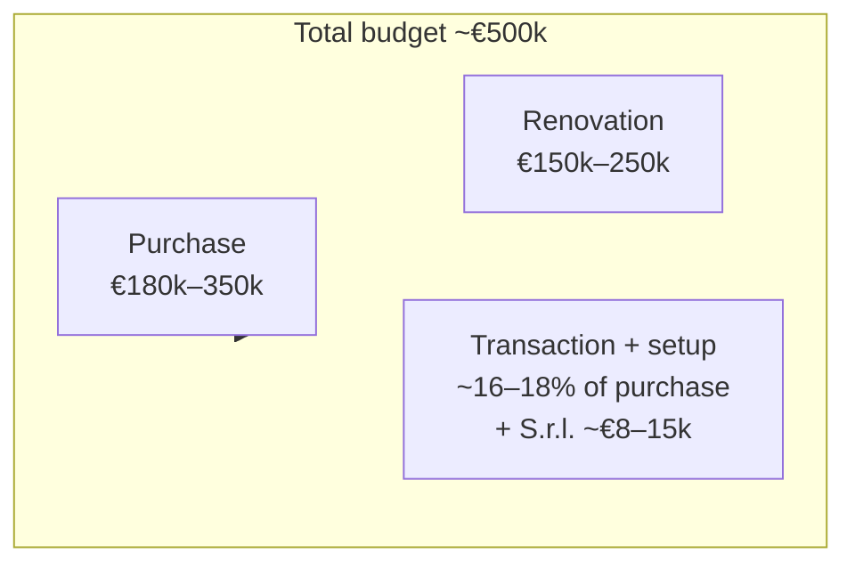

# Visual tools for decision-making — Italy Deal #1

Graphs, tables, and interactive tools to compare options, track progress, and run quick numbers. **Static** views live in this doc (Mermaid + tables); **interactive** tools are in [docs/tools/](tools/) (open the HTML files in a browser).

---

## 1. Region scorecard (compare target areas)

Use this to compare the 8 shortlisted regions. Sort by your priority (e.g. lowest €/m², or "prefab possible"). For **sortable/filterable** version → [tools/region-scorecard.html](tools/region-scorecard.html).

| Region | €/m² (approx) | €500k feasible? | STR demand | Value-add / prefab | Permit ease | Main risk |
|--------|----------------|-----------------|------------|--------------------|-------------|-----------|
| **Puglia** (Valle d'Itria / Salento) | ~€1,437 | Yes (high-end) | Very high | Moderate (experienced) | Moderate | Saturation in hubs |
| **Sicily** (Val di Noto) | €712–€1,500 | Yes (multiple units) | High | Moderate | Moderate (bureaucracy) | Logistics |
| **Umbria** (inland) | ~€1,173 | Yes (substantial) | High | High (expat-ready) | Relatively straightforward | Seasonality (no coast) |
| **Abruzzo** (coast + inland) | ~€1,379 | Yes (land + prefab) | Moderate (emerging) | High (supportive towns) | High | Low brand awareness |
| **W. Liguria** (Riviera di Ponente) | €2,500–3,000 | Yes (compact unit) | Very high | Low (strict regs) | Challenging | High €/m² |
| **Tuscany** (Maremma / Arezzo) | ~€1,684 | Yes (secondary areas) | Very high | Very low (vincoli) | Difficult | Saturated listings |
| **Molise** (Termoli) | ~€1,028 | Yes (volume play) | Emerging | High | Easier | Low liquidity |
| **Calabria** (Cedar Coast) | ~€958 | Yes (portfolio) | Moderate (seasonal) | High | Variable | Weaker economy |

**Filters to apply in your head or in the HTML tool:** Prefab only? → Abruzzo (and avoid Punta P. park). Lowest entry? → Calabria, Molise. Best STR demand? → Puglia, Liguria, Tuscany. Easiest permits? → Umbria, Abruzzo, Molise.

---

## 2. Budget allocation (where €500k goes)

High-level flow. For **editable inputs and CAD conversion** → [tools/budget-calculator.html](tools/budget-calculator.html).



| Component | Low | High | Notes |
|-----------|-----|------|--------|
| Purchase | €180k | €350k | Unrenovated villa / stone shell (90–120 m² typical) |
| Renovation | €150k | €250k | €1,000–1,350/m² structural + finishes |
| Transaction (S.r.l.) | ~16% | ~18% | 9% tax + notary + agency + technical |
| S.r.l. setup | €6.5k | €13k | One-time; + €4.5–9k/year compliance |
| **Total all-in** | **~€400k** | **~€500k** | Excl. FX spread; plan €300–350k CAD liquid |

---

## 3. Timeline to first booking (critical path)

Indicative phases and durations. Adjust "Start" to your target date.

```mermaid
gantt
    title Deal #1 — Discovery to first STR booking
    dateFormat  YYYY-MM-DD
    section Setup
    Codice Fiscale + reciprocity check    :a1, 2026-03-01, 4w
    S.r.l. incorporation + bank account    :a2, after a1, 6w
    section Search & offer
    Property search + geometra DD         :b1, after a2, 8w
    Proposta + caparra                    :b2, after b1, 2w
    section Contract & close
    Compromesso + due diligence           :c1, after b2, 6w
    Rogito (final deed)                   :c2, after c1, 2w
    section Build
    Permits (CILA/SCIA or PdC)           :d1, after c2, 4w
    Renovation works                     :d2, after d1, 16w
    section Operate
    CIN + insurance + SPOT               :e1, after d2, 2w
    First booking                         :milestone, e1, 0d
```

**Rough totals:** Setup 10w, Search+offer 10w, Close 8w, Permits 4w, Reno 16w, Launch 2w → **~50 weeks** from start to first booking (coastal reno; PdC or sanatoria can add months).

---

## 4. Compliance checklist (Italy + Canada)

Track what’s done. For **interactive checklist** (saves in browser) → [tools/compliance-checklist.html](tools/compliance-checklist.html).

### Italy — pre-launch

- [ ] Codice Fiscale (all directors/shareholders)
- [ ] Reciprocity confirmed for target comune with notary
- [ ] S.r.l. incorporated (Atto Costitutivo, Statuto, Registro delle Imprese)
- [ ] Corporate bank account open (or nominee/proxy in place)
- [ ] Geometra: Conformità Urbanistica e Catastale verified
- [ ] Purchase: compromesso transcribed, rogito signed, taxes paid
- [ ] Building/reno permits (CILA / SCIA / PdC) in place
- [ ] Construction: CAR + RC Postuma (if heavy reno/new build)
- [ ] Regional CIR (Puglia: DMS Puglia) obtained
- [ ] CIN obtained (BDSR portal) and displayed
- [ ] RCT insurance (mandatory for STR; €500k–1.5M typical)
- [ ] STR-specific policy (guest damage, loss of income) if required
- [ ] CIA/SCIA for entrepreneurial activity (SUAP)
- [ ] Alloggiati Web access (guest reporting)
- [ ] SPOT (Puglia) or regional monthly reporting set up
- [ ] Tourist tax registration (comune)
- [ ] Safety: extinguishers, gas/CO detectors installed and certified

### Canada — ongoing

- [ ] T1134 (foreign affiliate) filed if S.r.l. held — deadline 10 months after year-end
- [ ] T1135 filed if other specified foreign property >$100k CAD
- [ ] Quebec TP-1079.8.BE-V if applicable (from 2025)
- [ ] ACB tracked: BoC exchange rate on date of each payment (purchase + reno)
- [ ] Invoices and payment receipts kept for all reno spend
- [ ] Canadian tax advisor briefed on structure (FAPI, RTF, exit)

---

## 5. Risk matrix (impact × likelihood)

Prioritize mitigations: top-right = high impact, high likelihood. See [05 §4 Risk register](05-finance-compliance-risks.md#4-risk-register) for full mitigations.

Plot each risk in a 2×2: **Impact** (vertical) × **Likelihood** (horizontal). Top-right = tackle first. Use the table below in Excel or [Mermaid Live](https://mermaid.live) to draw a scatter if needed.

| Risk | Likelihood (1–5) | Impact (1–5) | Mitigation priority |
|------|------------------|--------------|---------------------|
| Reciprocity (wrong comune) | 5 | 5 | Confirm with notary before caparra |
| Società di comodo | 5 | 5 | Plan ≥4.75% revenue from day one |
| Construction overruns | 4 | 4 | Contingency, contracts, governance |
| Permits delay | 4 | 4 | Due diligence; avoid PdC in park if timeline critical |
| Cross-border tax | 3 | 5 | Italy + Canada advice; T1134/T1135 |
| FX (CAD weak) | 3 | 3 | Forward once compromesso signed |
| Liquidity (slow resale) | 3 | 3 | Underwrite exit; don’t rely on quick flip |
| STR operations | 3 | 3 | Seasonality, management, reserves |

---

## 6. Scenario comparison (choose your path)

Quick compare 3–4 ways to run the deal. Use this to agree "we’re optimizing for X".

| Scenario | Est. total cost | Timeline to first booking | Tax / structure | Complexity | Best for |
|----------|-----------------|---------------------------|------------------|------------|----------|
| **A. Puglia reno, S.r.l., no grant** | €450–500k | ~12 months | FAPI RTF 1.9 (residual CA tax) | Medium | Default; proven STR market |
| **B. Puglia reno, S.r.l., Mini PIA** | €300–400k net | ~14 months | Same; grant 40–50% of eligible | Medium–high | Lower net outlay; more admin |
| **C. Puglia reno, HoldCo → S.r.l.** | €450–500k | ~12 months | FAPI RTF 4.0 (no extra CA tax) | Higher | Canadian tax efficiency |
| **D. Sicily reno, S.r.l.** | €400–450k | ~12 months | Same as A | Medium | Best €/m²; accept logistics |
| **E. Abruzzo land + prefab** | €350–450k | ~14–18 months | S.r.l. or HoldCo | High | Dual-season; prefab only viable here |

---

## 7. Interactive tools (open in browser)

| Tool | What it does | File |
|------|----------------------|------|
| **Region scorecard** | Sort by €/m², STR demand, prefab; filter by "€500k feasible", "Prefab possible" | [tools/region-scorecard.html](tools/region-scorecard.html) |
| **Budget calculator** | Enter purchase, reno, transaction %; FX rate → total EUR/CAD; optional ADR + occupancy → simple gross yield | [tools/budget-calculator.html](tools/budget-calculator.html) |
| **Compliance checklist** | Check off Italy + Canada items; state saved in browser (localStorage) | [tools/compliance-checklist.html](tools/compliance-checklist.html) |

---

*Sources: [04-operations](04-operations.md), [05-finance-compliance-risks](05-finance-compliance-risks.md), [00-Research-TLDR](00-Research-TLDR.md), research results in [docs/research/results/](research/results/).*
